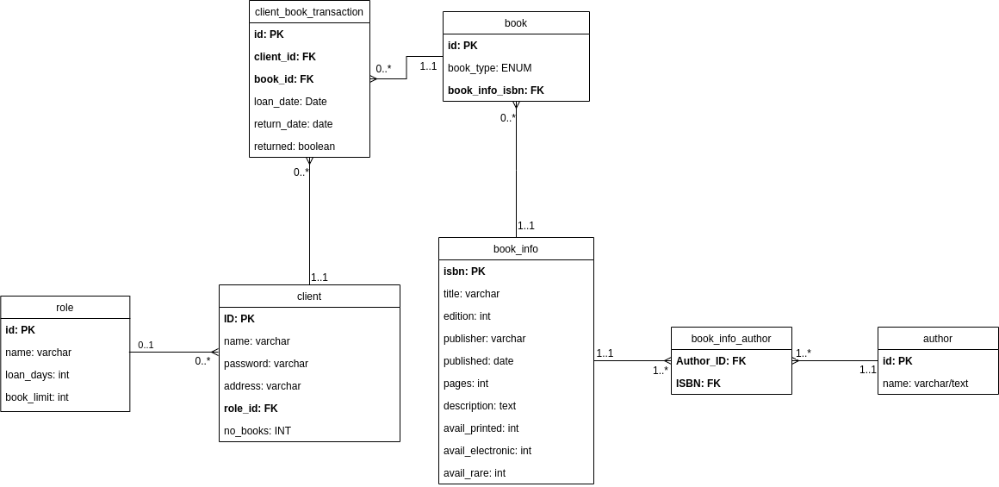

# Mini Project 1: SQL Databases V2

This project contains our proposed solution to the [first Mini Project described here.](https://datsoftlyngby.github.io/soft2020spring/resources/d3821340-MP1-2.pdf)

## a) formulating specifications

We have formulated the specifications by answering all of the following points.

## b) creating appropriate data model

From the business requirments we created the following ER diagram:  


## c) creating and populating the database with sufficient test data

To create and populate the database run the following script which can be [downloaded here.](./populate_tables.sql)  
We have also split the different sql queries into parts to make it more readable. These files can be found in this repository.

## d) programming the requested functionality in SQL

The requested functionality as described by the business requirements are as follows:  
Search and retrieve information such as, but not limited to:

1. current availability of a specific book  
   To get the availability of a specific book we have created the following view:

```sql
create or replace view book_transactions as
    select c.id as client_id, cbt.returned, cbt.return_date, bi.isbn, bi.title, bi.edition, bi.publisher, bi.published, bi.pages, bi.description
    from client as c
    JOIN client_book_transaction as cbt on cbt.client_id=c.id
    JOIN book as b on b.id = cbt.book_id
    JOIN book_info as bi ON bi.isbn = b.book_info_isbn
    where cbt.returned = 't';
```

To get the availability from the view, the following query should be called:  
`SELECT * FROM book_transactions bt WHERE bt.client_id=ID`  
where ID is the ID of the book you want to get the availability for.  
Another, probably better solution would be to add another field on book to see if it is available. This would avoid having to make these JOINs.

2. most popular book title among high scool students in a specific period of time.  
   To get the most popular book for students over a specific period of a time we have created the following function which returns a table with the data:

```sql
DROP FUNCTION IF EXISTS most_popular_book(date,date);

CREATE OR REPLACE FUNCTION most_popular_book(start_date date, end_date date)
RETURNS TABLE
(
    ct bigint,
    title varchar(256),
    isbn varchar(13)
) as $$
begin
    return query select count(st.isbn) as ct, st.title, st.isbn from
    (select bi.title, bi.isbn from book_info as bi
    join book b ON b.book_info_isbn = bi.isbn
    join client_book_transaction cbt on cbt.book_id = b.id
    join client c on cbt.client_id = c.id
    where cbt.loan_date > '2019-01-01'
    and cbt.loan_date < '2020-08-08' and c.role_id = 3) as st
    group by st.isbn, st.title
    order by ct desc limit 1;
end;
$$
language plpgsql;
```

3. notifications about delayed returning of a book over the due time.
   We have created the following view to get all books that are overdue:

```sql
drop view if exists overdue_books;

create or replace view overdue_books as
    select c.id as client_id, cbt.returned, cbt.return_date, bi.isbn, bi.title, bi.edition, bi.publisher, bi.published, bi.pages, bi.description
    from client as c
    JOIN client_book_transaction as cbt on cbt.client_id=c.id
    JOIN book as b on b.id = cbt.book_id
    JOIN book_info as bi ON bi.isbn = b.book_info_isbn
    where cbt.returned = 'f'
    and cbt.return_date < current_date;
```

Looking back, this view could be replaced by a function that simply searches the `book_transactions` view mentioned in 1. with the last line from `overdue_books`.

In addition to the requested features we implemented these:

1. Search for a book by book name  
   We created the following function to search for a book by using a tsquery.

```sql
DROP FUNCTION IF EXISTS find_book;
create or replace function find_book(str varchar)
returns table
(
    isbn varchar(13),
    title varchar(256),
    edition int,
    publisher varchar(256),
    published date,
    description text,
    avail_printed int,
    avail_electronic int,
    avail_rare int
) as $$
begin
    return query select
        bi.isbn,
        bi.title,
        bi.edition,
        bi.publisher,
        bi.published,
        bi.description,
        bi.avail_electronic,
        bi.avail_printed,
        bi.avail_rare
        from book_info bi
    where bi.title @@ str;
end;
$$ language 'plpgsql';
```

To use this function to search for books, use the following query:  
`SELECT * FROM find_book('Harry Potter')`

## e) add constrains reflecting the business rules

According to the business requirements the following contraints were implemented:

1. Books can be ordered and borrowed by registered clients, only.

   We created a role called unregistered which we assume will be used if no user have been logged in from the frontend. This role has only **SELECT** privilege on the book and book_info tables. Which means they can only search for books. For registered users we have created the client role which is allowed to loan books. For more detailed **ROLE** and **USER** overview,
   read the last section i).

2. The allowable loan period, as well as the number of books in a loan can vary. (For example, students can loan maximum three books at a time, teachers can have up to two, while other borrowers can take just one)

   We created the following function for when books are to be loaned:

```sql
CREATE OR REPLACE FUNCTION loan_book(client_id int, book_id int)
RETURNS boolean AS $$
DECLARE
    can_loan boolean := false;
    client_no_books integer;
    role_book_limit integer;
    book_type text;
BEGIN
    SELECT no_books INTO client_no_books FROM client c WHERE c.id=client_id;
    SELECT book_limit INTO role_book_limit FROM role r JOIN client c ON c.role_id=r.id AND c.id=client_id;
    SELECT type INTO book_type FROM book b WHERE b.id=book_id;
    IF client_no_books < role_book_limit THEN
        can_loan := true;
        UPDATE client SET no_books=no_books+1 WHERE client.id=client_id;
        CASE book_type
            WHEN 'printed'
                THEN UPDATE book_info SET avail_printed=avail_printed-1 FROM book_info JOIN book WHERE book_info.isbn=book.book_info_isbn;
            WHEN 'electronic'
                THEN UPDATE book_info SET avail_electronic=avail_electronic-1 FROM book_info JOIN book WHERE book_info.isbn=book.book_info_isbn;
            WHEN 'rare'
                THEN UPDATE book_info SET avail_rare=avail_rare-1 FROM book_info JOIN book WHERE book_info.isbn=book.book_info_isbn;
        INSERT INTO transaction (client_id, book_id, loan_date, return_date, returned)

    END IF;
    RETURN can_loan;
END;
$$ LANGUAGE plpgsql;
```

In this function we check how the current amount of books the client has compares to the book loan limit on the role.

## f) add constrains ensuring referential integrity

When referring to rows in other tables we always use the primary key from the referred table as a foreign key. As we do not **DELETE** rows from our tables, **CASCADE** is not needed.

## g) keeping transactions ACID and protected against blocking and deadlocks

For all of our **INSERT** and **UPDATE** queries we use the default isolation level for Postgres **READ COMMITTED** which prevents dirty reads.  
Whenever you want to read from tables you should use the SERIALIZABLE isolation level, to ensure you have consistent data.

```sql
SET TRANSACTION ISOLATION LEVEL SERIALIZABLE;
BEGIN TRANSACTION;
SELECT * FROM find_book('Harry Potter');
COMMIT;
```

## h) considering optimization of the queries

We have not added any indexes as it did not improve the performance of the queries. However this could be due to the sample data being too small and PostgreSQL selecting sequential search as a faster option. We have tested the following index:  
`create index isbn_index on book(book_info_isbn);`  
**Before indexing:**  
  
**After indexing:**


## i) protecting the use of the database with user account management, and control of privileges.

### Roles and permissions

We have created four roles:

<table>
    <tr>
        <th>Role</th>
        <th>role (table)</th>
        <th>client</th>
        <th>book</th>
        <th>book_info</th>
        <th>author</th>
        <th>book_info_author</th>
        <th>client_book_transaction</th>
    </tr>
    <tr>
        <td>unregistered</td> <role>
        <td></td> 
        <td></td> 
        <td>SELECT</td> 
        <td>SELECT</td> 
        <td></td> 
        <td></td> <book_info_author>
        <td></td> 
    </tr>
    <tr>
        <td>client</td> <role>
        <td></td> 
        <td>SELECT, UPDATE</td> 
        <td>SELECT</td> 
        <td>SELECT, UPDATE</td> 
        <td></td> 
        <td></td> <book_info_author>
        <td>INSERT, SELECT, UPDATE</td> 
    </tr>
    <tr>
        <td>worker</td> <role>
        <td>SELECT</td> 
        <td>SELECT, UPDATE</td> 
        <td>INSERT, SELECT, DELETE, UPDATE</td> 
        <td>INSERT, SELECT, DELETE, UPDATE</td> 
        <td>SELECT</td> 
        <td>SELECT</td> <book_info_author>
        <td>INSERT, SELECT, UPDATE</td> 
    </tr>
    <tr>
        <td>admin</td> <role>
        <td>CRUD</td> 
        <td>CRUD</td> 
        <td>CRUD</td> 
        <td>CRUD</td> 
        <td>CRUD</td> 
        <td>CRUD</td> <book_info_author>
        <td>CRUD</td> 
    </tr>
</table>

### Additional permissions:

**client**: **EXECUTE** the loan_book function. **SELECT** on **SEQUENCE** client_book_transaction_id_seq.  
**worker**: **SELECT** on all tables. **INSERT, DELETE, UPDATE** on book, book_info. **SELECT** on **SEQUENCE** book_id_seq.  
**admin**: **PRIVILEGES** on all sequences.

### Users

Aditionally we have created three users with encrypted passwords:  
**Username**: unregistered_user **Password**: 1234  
**Username**: client_user **Password**: Passw0rd  
**Username**: worker_user **Password**: Passw0rd  
**Username**: admin_user **Password**: Admin
